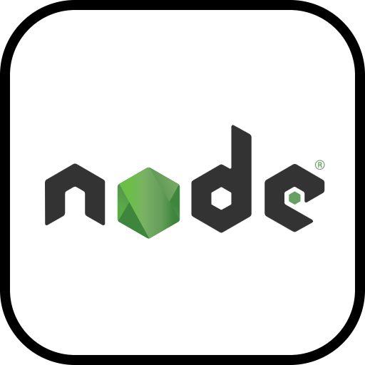

# GoMusic WebApp
This is a web application for online music streaming, developed as a project for my second-year university course. The website is built using the MERN stack, which includes MongoDB, Express.js, React.js, and Node.js.
 
<h2 align="center">🛠 Libraries & Frameworks 🛠</h2>
 
<!-- https://icons8.com -->

    
    
    
    

- [Backend](https://github.com/quaan2hand/music-webapp-mern/tree/main/Backend) - A TypeScript Client for Solar Core
- [Frontend](https://github.com/quaan2hand/music-webapp-mern/tree/main/frontend) - A TypeScript Client for Solar Core

## Features

- User Registration and Authentication: Users can create accounts, log in, and securely access their personalized profiles.
- Browse and Search Music: Users can explore a vast collection of songs, albums, and artists, and search for specific tracks or artists.
- Music Playback: Users can listen to their favorite songs, create playlists, and control playback features like play, pause, skip, and volume control.
- Personalized Recommendations: The website provides personalized music recommendations based on the user's listening history and preferences.
- Social Features: Users can follow their favorite artists, share music with friends, and discover new music through social interactions.
- User-generated Content: Users can rate songs, write reviews, and contribute to the community by creating and curating playlists.

## Technologies Used

- **Frontend**: The frontend of the website is developed using React.js, a popular JavaScript library for building user interfaces.
- **Backend**: The backend is powered by Node.js and Express.js, providing a scalable and efficient server-side architecture.
- **Database**: MongoDB is used as the database management system to store user information, music metadata, and user-generated content.
- **Authentication**: User authentication and session management are implemented using JSON Web Tokens (JWT) for secure access control.
- **External APIs**: Integration with external APIs allows for features like fetching music metadata, social sharing, and personalized recommendations.
